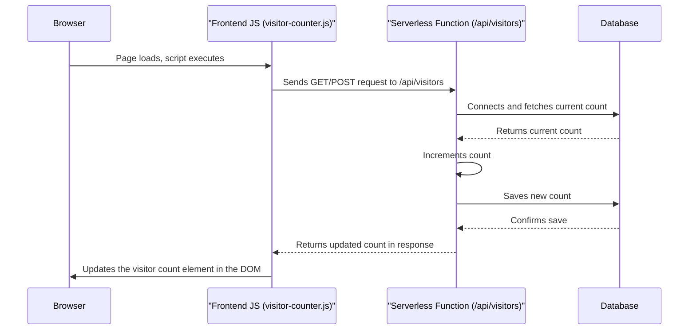
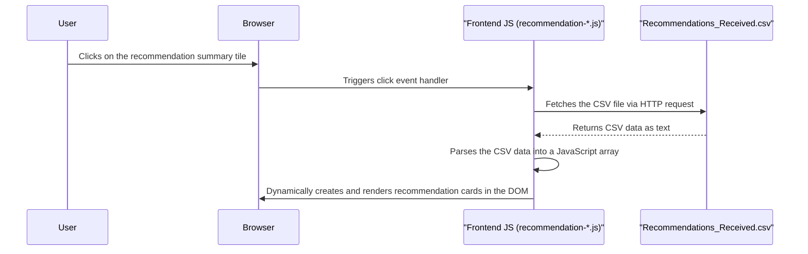

# Technical Documentation: Suduli's Interactive Automotive Resume

This document provides a comprehensive technical overview of the Suduli's Interactive Automotive Resume project. It is intended for developers, project managers, and other stakeholders who need to understand the project's architecture, features, and file structure.

## 1. Detailed Specification

### 1.1. Project Purpose
This project is a dynamic and interactive online resume for Suduli, designed to showcase their skills, experience, and professional recommendations to potential employers and contacts, with a particular focus on the automotive and technology sectors. It aims to provide a more engaging experience than a traditional paper resume.

### 1.2. Features
*   **Interactive Particle Background:** Utilizes `particles.js` to create a dynamic and engaging background that responds to user interaction.
*   **Smooth Animations & Transitions:** Leverages `anime.js` to implement fluid animations for hero section text, skill bars, and other UI elements, enhancing the user experience.
*   **Interactive Skills Explorer:** A sophisticated interface to browse skills. It includes:
    *   Real-time search functionality.
    *   Filtering by skill category.
    *   Togglable grid and list views.
    *   Detailed information panels for each skill.
    *   Full keyboard accessibility.
*   **Dynamic Recommendations Showcase:** Fetches and displays professional recommendations from a `Recommendations_Received.csv` file. The UI includes:
    *   A summary tile that loads recommendations on click.
    *   Horizontally scrollable cards for individual recommendations.
    *   Expandable cards to view full recommendation text.
*   **Live Visitor Counter:** A real-time counter that tracks the number of unique visitors. This feature demonstrates backend integration with a serverless function and a database.
*   **Modern & Responsive Design:** The website is built with a mobile-first approach, ensuring a seamless experience across all devices. It features modern design trends like gradients and a clean layout.
*   **Professional Content Sections:** Includes dedicated sections for a professional summary, work experience, education, and featured projects.

### 1.3. Target Audience
*   **Recruiters and Hiring Managers:** Primarily from the automotive and tech industries, who are looking for qualified candidates.
*   **Professional Network:** Colleagues and contacts who wish to view Suduli's professional profile or leave a recommendation.
*   **Technical Evaluators:** Individuals who may be assessing Suduli's coding skills and ability to build a web application.

## 2. Architectural Overview

The project follows a modern **Jamstack architecture**, which decouples the frontend from the backend. The frontend is a static site built with HTML, CSS, and JavaScript, while the backend logic is handled by serverless functions. This architecture provides benefits such as high performance, scalability, and improved security.

### 2.1. Key Components & Technologies

*   **Frontend:**
    *   **HTML5, CSS3, and JavaScript (ES6+):** The core technologies for building the user interface.
    *   **`particles.js`:** A lightweight library for creating the interactive particle animation in the background.
    *   **`anime.js`:** Used for creating smooth, complex animations for UI elements like text and progress bars.
    *   **Font Awesome:** Provides a wide range of icons used throughout the site.
    *   **Google Fonts:** Used for custom typography (`Orbitron` and `Rajdhani`).

*   **Backend (Serverless):**
    *   **Node.js:** The runtime environment for the serverless function.
    *   **Vercel Functions:** The project is configured to use Vercel for hosting and for running the serverless function (`api/visitors.js`).

*   **Database:**
    *   The visitor counter requires a persistent data store. The project includes schema files for two options:
        *   **Google Firestore (`firestore-schema.json`):** A NoSQL, document-based database.
        *   **Supabase (`supabase-schema.sql`):** A PostgreSQL-based database, providing a more traditional relational structure.

### 2.2. Data Flow Diagrams

#### Visitor Counter Data Flow

This diagram illustrates how the visitor count is updated and displayed.

#### Recommendations Data Flow

This diagram shows how recommendations are loaded and displayed from the CSV file.

### 2.3. System Interactions
1.  **Initial Page Load:** When a user visits the site, the browser loads `index.html`, which in turn loads the necessary CSS and JavaScript files. The `particles.js` script initializes the background animation.
2.  **Visitor Counter:** The `visitor-counter.js` script makes an API call to the `/api/visitors` serverless function. This function handles the logic of incrementing and persisting the visitor count in the chosen database.
3.  **Skills Explorer:** The user can interact with the skills section by searching, filtering, and changing views. All of this logic is handled on the client-side by the JavaScript in `assets/js/core/skills/skills-data.js` and `assets/js/core/main.js`.
4.  **Recommendations:** When the user clicks on the recommendation summary, the `recommendation-cards.js` script fetches the `Recommendations_Received.csv` file, parses it, and dynamically generates the HTML for the recommendation cards.
5.  **Deployment:** The project is configured for deployment on Vercel. The `vercel.json` file specifies how the serverless function should be handled. Any push to the `main` branch on GitHub triggers an automatic deployment.

## 3. File Structure Description

Here is a breakdown of the project's file and directory structure:

*   `index.html`: The main entry point of the website.
*   `LICENSE`: The license file for the project.
*   `package.json`: Defines project metadata and dependencies.
*   `README.md`: The main README file with an overview of the project.
*   `styles.css`: Main stylesheet for the application.
*   `vercel.json`: Configuration file for deploying the project to the Vercel platform.

*   **`api/`**: Contains the backend serverless functions.
    *   `visitors.js`: The Node.js function that manages the visitor counter logic.

*   **`assets/`**: Contains all static assets for the project.
    *   **`css/`**: Additional stylesheets.
        *   `main.css`: General styles.
        *   `visitor-counter.css`: Styles specific to the visitor counter.
    *   **`data/`**: Contains data files.
        *   `Recommendations_Received.csv`: CSV file with recommendation data.
        *   `Suduli_7_10_year-1.txt`: Text file, likely containing resume information.
    *   **`js/`**: Contains JavaScript files.
        *   **`core/`**: Core application logic.
            *   `main.js`: Main JavaScript file.
            *   `skills/skills-data.js`: Data for the skills section.
            *   `vendor/particles-fallback.js`: Fallback for the particle animation.
        *   **`features/`**: Contains feature-specific JavaScript.
            *   `visitor-counter.js`: Client-side logic for the visitor counter.
            *   `recommendations/`: Logic for the recommendations feature.
                *   `recommendation-cards.js`: Creates and manages recommendation cards.
                *   `recommendation-summary.js`: Manages the summary view of recommendations.
        *   **`utils/`**: Utility functions.
            *   `recommendation-utils.js`: Helper functions for handling recommendation data.

*   **`database/`**: Contains database schema definitions.
    *   `firestore-schema.json`: Schema for a Google Firestore database.
    *   `supabase-schema.sql`: SQL schema for a Supabase (PostgreSQL) database.

*   **`docs/`**: Contains project documentation.
    *   `ACCESSIBILITY.md`: Documentation on accessibility considerations.
    *   `DEPLOYMENT-CHECKLIST.md`: A checklist for deploying the project.
    *   `IMPLEMENTATION-SUMMARY.md`: A summary of the project's implementation.
    *   `QUICKSTART.md`: A guide to quickly get the project running.
    *   `README-STRUCTURE.md`: A guide to the structure of the README files.
    *   `README-visitor-counter.md`: Specific documentation for the visitor counter feature.

*   **`tests/`**: Contains test files for the project.
    *   `recommendations.test.js`: Tests for the recommendations feature.
    *   `test-visitor-counter.html`: An HTML file for testing the visitor counter.
    *   `visitor-counter.test.js`: Tests for the visitor counter feature.
